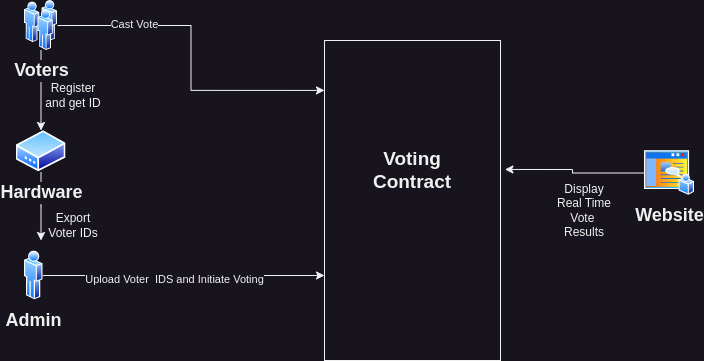

# Decentralized Voting

A decentralized voting system using blockchain technology

## System Workflow

A brief explanation of the application

1. Voters register by capturing their identity with an identity capturing hardware and are assigned an ID
2. The admin upload the id of the registered users to the smart contract
3. The admin initiate the voting process and set the start and end dates
4. Users interact with either the smart contract or the identity capturing hardware to cast their vote
5. A website provide real time vote results to anyone to track and verify the results of the voting process

## Diagram

